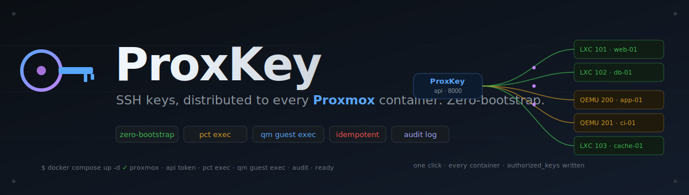
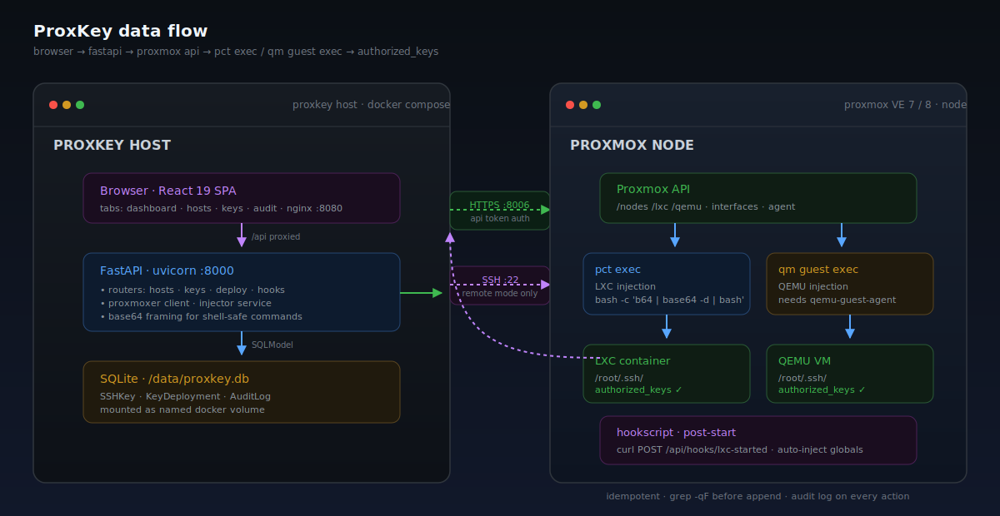

<p align="center">
  
</p>

<p align="center">
  <a href="https://harshithsunku.github.io/proxkey/"></a>
  <a href="https://github.com/harshithsunku/proxkey/actions/workflows/build.yml"></a>
  <a href="https://github.com/harshithsunku/proxkey/releases/latest"></a>
  <a href="https://github.com/harshithsunku/proxkey/stargazers"></a>
  <a href="#quick-start"></a>
  
  
  
  
  
</p>

<p align="center">
  <strong>📖 <a href="https://harshithsunku.github.io/proxkey/">Read the documentation site →</a></strong><br>
  <sub>Hosted on GitHub Pages — features, architecture deep-dive, API reference, deployment guide.</sub>
</p>

# ProxKey

**ProxKey** is a self-hosted web app that distributes SSH public keys across Proxmox LXC containers and QEMU VMs — **without ever needing prior SSH access to the guest**. It talks to the Proxmox API, executes inside the guest via `pct exec` (LXC) or `qm guest exec` (QEMU), and writes the right keys to the right `authorized_keys` file.

> Create a container. SSH in immediately. No manual key copying, ever.

No agent on the guest, no Ansible inventory, no Terraform state. One web UI, one Proxmox API token, and any key in your library is on any host with one click.

---

## Highlights

- **Zero-bootstrap injection** — uses Proxmox's own `pct exec` and `qm guest exec`, so brand-new containers with no SSH access yet are first-class
- **Auto-discovery** — lists every LXC and QEMU VM on the node via the Proxmox API; running hosts surface their IP addresses automatically
- **Idempotent deploy** — the injection script `grep -qF`s before appending, so re-deploying the same key is safe
- **Key revocation** — strips a deployed key cleanly from any host using the same execution path
- **Hookscript endpoint** — `POST /api/hooks/lxc-started` lets a Proxmox hookscript auto-inject keys the moment a container starts
- **Per-host or global assignment** — store multiple SSH keys, pin some to specific hosts, mark others as global
- **Inspect mode** — see exactly which keys live on any host without touching the guest's filesystem manually
- **Dashboard** — stats cards, host-type breakdown, key-coverage donut chart, deployment metrics
- **Audit log** — every injection, revocation, and key CRUD event recorded with timestamp, host, and outcome
- **Search, filter, sort** — find hosts by name, VMID, or IP; filter by status/type; sort by any field
- **One-click SSH copy** — `ssh root@<ip>` ready to paste, straight from the host card
- **Two-container Compose deploy** — FastAPI backend + nginx-served React frontend, one `docker compose up -d` away

---

## Architecture

<p align="center">
  
</p>

The pipeline in one sentence: **Browser → React UI → FastAPI → Proxmox API → `pct exec` / `qm guest exec` → guest's `authorized_keys`.**

### Browser

A single-page React 19 app (Vite, Tailwind v4, TanStack Query, Zustand) with four tabs: Dashboard, Hosts, SSH Keys, Audit Log. Nginx serves the static build and proxies `/api` to the backend.

### Backend

FastAPI app with three routers:

- **`hosts`** — Proxmox discovery (`/api/hosts`), connection probe (`/api/hosts/connection`), per-host key inspection (`/api/hosts/{vmid}/keys`).
- **`keys`** — CRUD over the stored SSH public key library; fingerprint computed on save.
- **`deploy`** — deploy a key, revoke a key, dashboard stats, full deployment status, audit log.
- **`hooks`** — receiver for Proxmox hookscripts so containers auto-receive keys at boot.

State lives in a single-file SQLite database (SQLModel) — keys, deployment records, audit entries — mounted as a Docker volume so it survives restarts.

### Injection path

The interesting part. ProxKey can run *on* the Proxmox node or *anywhere with API access*:

- **On the node:** `pct exec <vmid> -- bash -c '<base64 script | base64 -d | bash>'` (or `qm guest exec` for QEMU).
- **Remote:** `sshpass -p $PROXMOX_SSH_PASSWORD ssh root@<node> 'pct exec ...'` — same command, one extra layer.

Scripts are **base64-encoded before being piped** so shell quoting can't mangle them across SSH → `pct exec` → bash. The injection script itself is small, defensive, and idempotent:

```bash
mkdir -p /root/.ssh && chmod 700 /root/.ssh
touch /root/.ssh/authorized_keys && chmod 600 /root/.ssh/authorized_keys
grep -qF "$KEY" /root/.ssh/authorized_keys || echo "$KEY" >> /root/.ssh/authorized_keys
```

QEMU VMs need `qemu-guest-agent` installed and running for both IP discovery and `qm guest exec` to work. LXC needs nothing extra.

---

## Quick Start

```bash
# 1. Clone
git clone https://github.com/harshithsunku/proxkey.git
cd proxkey

# 2. Configure
cp .env.example .env
# edit .env with your Proxmox host, API token ID, and token secret

# 3. Run
docker compose up -d

# 4. Open http://localhost:8080
```

### Proxmox API token setup

On your Proxmox host:

```bash
pveum user add proxkey@pve
pveum aclmod / -user proxkey@pve -role PVEAuditor
pveum aclmod /vms -user proxkey@pve -role PVEAdmin
pveum user token add proxkey@pve proxkey --privsep 0
# copy the token secret → add to .env as PROXMOX_TOKEN_SECRET
```

### Optional: auto-inject on container start

Drop a hookscript on the Proxmox node that POSTs to `/api/hooks/lxc-started` when a container moves into the `running` state — ProxKey will push every "global" key into it before the first login window opens.

### Prerequisites

| Component | Needs |
|-----------|-------|
| **Proxmox** | VE 7.x or 8.x; an API token with `PVEAdmin` on `/vms` |
| **ProxKey host** | Docker + Compose, or Python 3.11+ and Node 20+ for source builds |
| **LXC guests** | Nothing extra — `pct exec` is built into PVE |
| **QEMU guests** | `qemu-guest-agent` installed and running for IP discovery + `qm guest exec` |
| **Remote mode** | SSH access to the Proxmox node and `sshpass` available in the backend container (already bundled) |

---

## Configuration

Everything is read from `.env`. The full list lives in [`.env.example`](.env.example); the load-bearing ones:

| Variable | Description |
|----------|-------------|
| `PROXMOX_HOST` | Proxmox server IP or hostname |
| `PROXMOX_PORT` | Proxmox API port (default `8006`) |
| `PROXMOX_VERIFY_SSL` | `true` / `false` — disable for self-signed PVE certs |
| `PROXMOX_TOKEN_ID` | API token ID, formatted as `user@realm!tokenname` |
| `PROXMOX_TOKEN_SECRET` | API token secret |
| `PROXMOX_NODE` | Default node name (e.g. `pve`) |
| `PROXMOX_SSH_USER` | SSH user on the PVE node (default `root`) |
| `PROXMOX_SSH_PASSWORD` | Password for the PVE node — only needed when ProxKey runs *off* the node and must SSH in to call `pct exec` |
| `PROXMOX_SSH_PORT` | SSH port on the PVE node (default `22`) |
| `SECRET_KEY` | Random string used to sign internal tokens |
| `CORS_ORIGINS` | Comma-separated list of allowed UI origins |

---

## HTTP API

| Method | Path | Description |
|--------|------|-------------|
| `GET` | `/api/health` | Health check |
| `GET` | `/api/hosts` | List all LXC + QEMU hosts with IPs |
| `GET` | `/api/hosts/connection` | Test the Proxmox API connection |
| `GET` | `/api/hosts/{vmid}/keys` | Inspect deployed keys on a single host |
| `GET` | `/api/keys` | List stored SSH public keys |
| `POST` | `/api/keys` | Add an SSH public key |
| `PUT` | `/api/keys/{id}` | Update a key (label, scope) |
| `DELETE` | `/api/keys/{id}` | Delete a key |
| `POST` | `/api/deploy` | Deploy one or more keys to one or more hosts |
| `POST` | `/api/deploy/revoke` | Revoke a key from one or more hosts |
| `GET` | `/api/deploy/stats` | Dashboard statistics |
| `GET` | `/api/deploy/status` | Full deployment record list |
| `GET` | `/api/deploy/audit` | Audit log |
| `POST` | `/api/hooks/lxc-started` | Hookscript receiver (auto-inject on start) |

Full live API docs at [`http://localhost:8000/docs`](http://localhost:8000/docs) once the backend is running.

---

## Development

### Backend

```bash
cd backend
python -m venv .venv && source .venv/bin/activate
pip install -r requirements.txt
uvicorn app.main:app --reload
# API:    http://localhost:8000
# Docs:   http://localhost:8000/docs
```

### Frontend

```bash
cd frontend
npm install
npm run dev
# UI: http://localhost:5173 (Vite proxies /api to localhost:8000)
```

### Full stack

```bash
cp .env.example .env
docker compose up --build
# UI:  http://localhost:8080
# API: http://localhost:8000
```

---

## Tech Stack

| Layer | Choice |
|-------|--------|
| Backend | Python 3.11+, FastAPI, SQLModel (SQLite), proxmoxer |
| Proxmox client | `proxmoxer` (REST), `pct exec` / `qm guest exec` via subprocess |
| Frontend | React 19, TypeScript, Vite, Tailwind CSS v4, TanStack Query, Zustand |
| Deploy | Docker Compose (backend container + nginx-fronted frontend container) |
| CI | GitHub Actions — multi-platform image builds, GHCR publish, GitHub Pages docs |

---

## CI

[`.github/workflows/build.yml`](.github/workflows/build.yml) builds the backend and frontend Docker images for `linux/amd64` and `linux/arm64` and pushes them to the GitHub Container Registry on every push to `main`. Tagged pushes (`v*`) additionally create a GitHub Release with the `docker-compose.yml` attached so downstream operators can grab a pinned manifest.

[`.github/workflows/pages.yml`](.github/workflows/pages.yml) publishes the static site under [`docs/`](docs/) to GitHub Pages on every push to `main`.

---

## Project layout

```
proxkey/
├── backend/                       # Python FastAPI backend
│   └── app/
│       ├── main.py                # App init, CORS, routers
│       ├── config.py              # Pydantic settings (.env loader)
│       ├── database.py            # SQLModel SQLite engine
│       ├── models.py              # DB models + request/response schemas
│       ├── routers/
│       │   ├── hosts.py           # Host discovery + key inspection
│       │   ├── keys.py            # SSH key CRUD
│       │   ├── deploy.py          # Deploy, revoke, stats, audit
│       │   └── hooks.py           # Proxmox hookscript receiver
│       └── services/
│           ├── proxmox.py         # Proxmox API client, discovery, exec
│           └── injector.py        # Key injection + revocation logic
├── frontend/                      # React + TypeScript SPA
│   └── src/
│       ├── App.tsx                # Layout, tabs (Dashboard/Hosts/Keys/Audit)
│       ├── api/                   # HTTP client, types, React Query hooks
│       ├── components/
│       │   ├── Dashboard.tsx
│       │   ├── HostGrid.tsx
│       │   ├── DeployPanel.tsx
│       │   ├── KeyManager.tsx
│       │   ├── AuditLog.tsx
│       │   ├── StatusBadge.tsx
│       │   └── ConnectionBadge.tsx
│       └── store/app.ts           # Zustand state (active tab, selection)
├── docs/                          # GitHub Pages documentation site
│   ├── index.html
│   ├── architecture.html
│   ├── reference.html
│   ├── hero.svg
│   ├── architecture.svg
│   └── assets/                    # styles.css, docs.js
├── docker-compose.yml             # Backend + frontend containers
├── .github/workflows/
│   ├── build.yml                  # Docker image build + GHCR push + release
│   └── pages.yml                  # GitHub Pages deploy
├── VERSION
├── LICENSE (MIT)
└── README.md (this file)
```

---

## Troubleshooting

**`/api/hosts/connection` fails with 401.** Token ID or secret is wrong. Recreate the token (`pveum user token add ...`) and double-check the format `user@realm!tokenname`.

**`pct exec` returns "Permission denied".** The API token needs `PVEAdmin` on `/vms`, not just `PVEAuditor`. Re-run `pveum aclmod /vms -user ... -role PVEAdmin`.

**QEMU host shows no IP / `qm guest exec` fails.** The VM needs `qemu-guest-agent` installed and the agent option enabled in the VM config (`qm set <vmid> --agent 1`).

**Remote mode hangs on `sshpass`.** ProxKey is trying to SSH to the node. Make sure `PROXMOX_SSH_PASSWORD` is set and the node accepts root password logins, or run ProxKey directly on the Proxmox node and leave the password blank.

**LXC IP missing.** The IP-discovery API only works for *running* containers and only after the network stack has come up. Wait ~5 seconds after start.

**Same key shows up twice on a host.** That shouldn't be possible — the injector `grep -qF`s first. If it does happen, check whether the deployed key has trailing whitespace or a comment that drifts between deploys.

---

## Design rules

- **Zero-bootstrap, always.** If a feature needs prior SSH access to the guest, it doesn't belong here.
- **Idempotent operations.** Deploy twice, revoke twice, restart the hookscript — none of it should corrupt state.
- **Defensive injection.** Base64 everything that crosses a shell boundary; never concatenate user input into a command.
- **No secrets in code.** The `.env` is the only place real credentials live; nothing should leak into images, logs, or audit entries.
- **No over-engineering.** If a piece of code doesn't earn its complexity, it gets cut.

See [`CLAUDE.md`](CLAUDE.md) for the full internal reference, or the [documentation site](https://harshithsunku.github.io/proxkey/) for the polished version.

---

## License

MIT. See [`LICENSE`](LICENSE).
